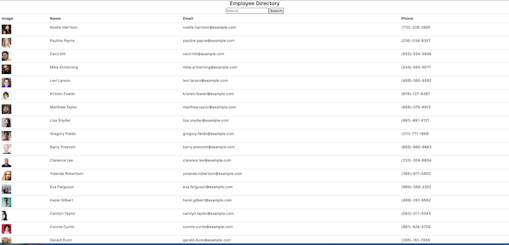

User directory created in React by breaking up the application's UI into components, manage component state and respond to user events.

The applicaiton allows you to view the entire employee directory at once so that you can have quick access to their information. 

An employee or manager can benefit greatly from being able to view non-senstive data about other employees. The employees can be filtered by name. 

Install: 
run 'npm install' from your terminal to install dependencies. 
run 'npm start'

Click on the link for an easy access to the application: 
https://tuhituhi18.github.io/User-Directory/